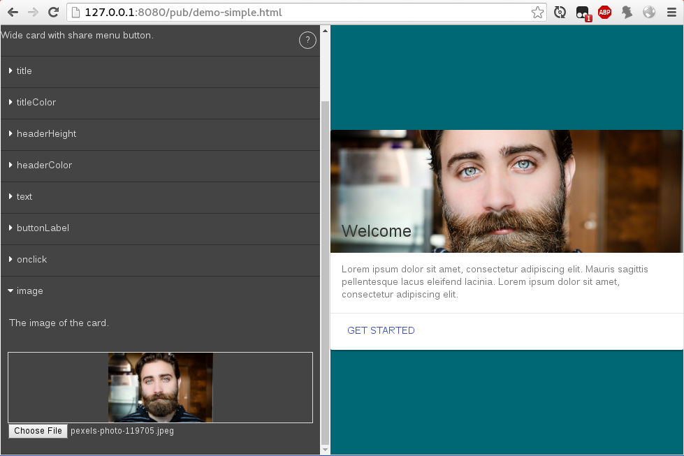

## Install

Add to your project and build `pub/prodotype.js`

```sh
$ npm install
$ npm run build
```

## Use in your projects

In your HTML page - e.g. see this [demo page](./pub/index.html)

```html
  <script type="text/javascript" src="./ejs.min.js"></script>
  <script type="text/javascript" src="./prodotype.js"></script>
  <div id="stage"></div>
  <div id="ui"></div>
```

In your js file - e.g. see this [demo script](./pub/demo.js) for a complete / real world example.
```js
// the div where you want your components to be rendered
const stage = document.querySelector('#stage');
// the div where we want the UI to edit the components
const ui = document.querySelector('#ui');
// where prodotype templates are located
const templateFolder = './sample'
// the main Prodotype object
const prodotype = new Prodotype(ui, templateFolder);
prodotype.ready(function(err) {
  // create a slide show in the stage div
  const templateName = 'unslider';
  prodotype.decorate(templateName).then(html => stage.innerHTML = html);
  // display tool boxes to edit the component
  prodotype.edit(data, [{templateName:templateName}], templateName, {
    onChange: function(newData, html) {
      stage.innerHTML = html;
    }
  });
});

```

Run it with `npm start` and you should be able to edit the component like this:



## create your own templates

Create a folder with a `.yaml` file and a `.ejs` file - see [the `sample/` folder](./sample/) to see examples of templates.

Then build your templates with this command line, which will generate a `components.json` in the destination folder (`pub/sample/` in this example):

```sh
$ npm run build:templates
```
[All the types of editors here](https://github.com/silexlabs/Prodotype/blob/master/src/Editor.js#L29)


## Development

Production (uses http-server to serve `pub/`):

```sh
$ npm start
```

Development (serve, watch, build and live reload):

```sh
$ npm run watch
$ npm run reload
```
